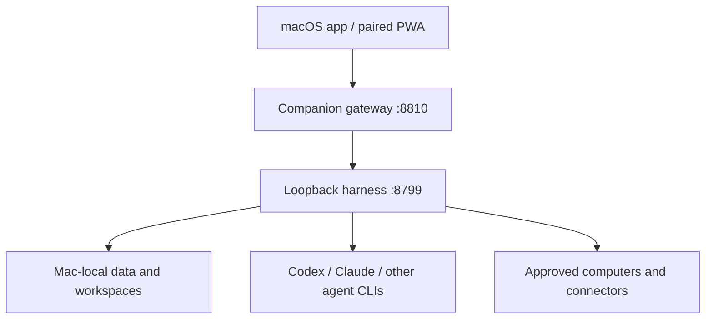

# Architecture

## System boundaries

The harness remains the single source of truth and listens only on `127.0.0.1`. Electron talks to it locally. Remote clients talk to the companion gateway, which authenticates the device, applies a method/path allowlist and capability checks, strips unsafe headers, and proxies accepted requests to loopback.

## Rendering and frontend

- React 19 and Vite produce one responsive application bundle.
- Electron loads the same bundle from the local harness.
- The companion serves the bundle as an installable PWA when `OMB_PWA_DIR` is configured.
- A session gate distinguishes trusted loopback Electron/browser use from remote PWA use. An unpaired PWA renders only the pairing screen.
- The service worker caches versioned application shell assets. API responses, transcripts, images, audio, event streams, and pairing responses are network-only and carry `private, no-store` headers.
- Mobile uses a drawer roster, safe-area insets, touch-size controls, and the same server-backed store as desktop. There is no second client-side database.

## Authentication and authorization

### Native companion clients

Native clients keep the upstream `Authorization: Bearer` device token. Only a SHA-256 digest is persisted by the Mac. Requests with an `Origin` header are not accepted as native requests.

### Browser PWA

1. The Mac owner opens a two-minute pairing window.
2. The browser submits the single-use credential to the same HTTPS origin serving the PWA.
3. The companion creates the existing paired-device record and writes the raw token only into an HttpOnly, SameSite=Strict cookie.
4. JavaScript receives public device metadata, never the token.
5. Mutations require an exact same-origin HTTPS `Origin`, `Sec-Fetch-Site: same-origin`, and `X-OpenMausBot-PWA: 1`.

Authentication proves the paired device. Authorization is still evaluated on every request:

- `chat`: ordinary bot/channel messaging and safe companion functions.
- `administration`: configuration, deletion, imports, webhooks, connector revocation, and host-affecting actions; off by default per device.
- `cloudDesktopAccess`: interactive remote cloud desktop joins; off by default per device.

The loopback control socket is the only surface that opens pairing, revokes devices, or changes device capabilities.

## Data ownership and synchronization

- `OMB_DATA_DIR` (default `~/.openmausbot`) owns bots, groups, routines, workspaces, attachments, decisions, and the SQLite message database.
- `OMB_COMPANION_DIR` (default `~/.openmausbot-companion`) owns only paired-device hashes and capability flags.
- The Mac is authoritative. Clients hydrate through REST and then fold the shared SSE stream, so desktop and PWA converge without duplicating server state.
- Local UI preferences such as skin and sidebar density may remain device-local because they are presentation, not shared project state.

## Secrets and trust boundaries

- Provider and connector secrets remain server-side and are write-only through APIs.
- Remote administration is not inferred from being paired.
- Agent/model output, retrieved web content, attachments, and connector output are untrusted data, not instructions for the gateway.
- Tool permissions and approval decisions remain enforced by the existing harness broker.
- Static file serving resolves real paths under one configured root and never serves dotfiles, source maps, or path traversal targets.

## Deployment topology

### Recommended macOS deployment

The signed macOS application launches the harness and companion. The packaged PWA assets are passed to the companion. Tailscale Serve terminates HTTPS on the tailnet and reverse proxies to companion loopback. No public Funnel is enabled by default.

### Docker deployment

Docker is for headless chat/orchestration, CI, and isolated Linux execution. It mounts durable harness and companion data and exposes the companion port to the host. Provider login directories are opt-in read/write mounts. Native macOS host control, Apple speech, and Keychain integration remain unavailable in the container.

## Failure behavior

- Harness unavailable: companion health returns 502 and PWA shows a reconnect state.
- Expired or revoked session: API returns 401, SSE reconnect stops, and the PWA returns to pairing.
- Stale SSE: the existing hello/resume protocol rehydrates at a defined boundary.
- Duplicate pairing redemption: a bounded request-id replay returns the same credential once; other replay attempts fail.
- Tailscale unavailable: the local Mac app remains usable; remote PWA is unavailable without exposing the harness.
- Invalid static path, unknown API route, or missing capability: fail closed.
- Container restart: persisted volumes restore server and paired-device state; in-flight agent processes are not assumed recoverable.

## Token efficiency

- Keep system/developer instructions, current user task, approvals, and explicitly pinned memory in protected context.
- Retrieve transcript pages and memory topics on demand instead of replaying full history to every collaborator.
- Reuse the existing compact MCP transcript/search interfaces for agent-to-agent handoffs.
- Record summaries as derived context with source message ranges; never delete canonical messages during compaction.
- Prefer the configured model for final work. Routing to a smaller model is opt-in rather than an invisible accuracy trade.

## Testing and rollout

- Unit tests cover cookie parsing, same-origin validation, CSRF, static paths, capability gates, revocation, and cache headers.
- Integration tests boot a real harness behind the companion.
- Browser QA covers unpaired, paired, revoked, offline shell, phone viewport, desktop viewport, keyboard, focus, and reduced motion.
- The feature ships disabled unless the companion is enabled and a PWA directory exists. Rollback is stopping the companion or removing the Tailscale Serve mapping; harness data is unchanged.
